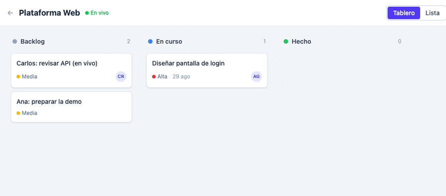
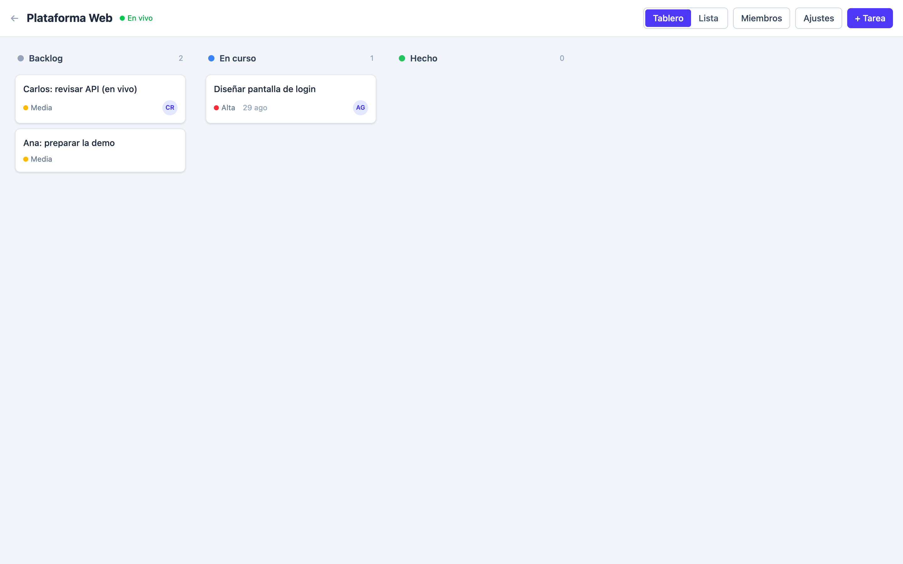
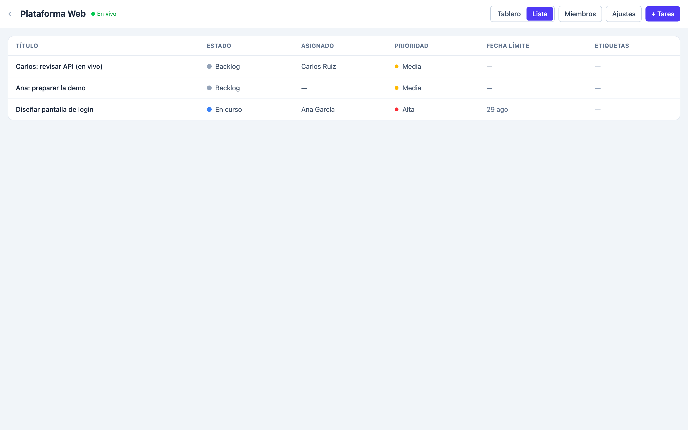

# Admin Manager — Gestor de proyectos


Gestor de proyectos de software **colaborativo** con tablero **Kanban**, estados
**dinámicos por proyecto** y actualizaciones en **tiempo real** por WebSocket.



- **Backend** (`backend/`): Python · FastAPI · SQLAlchemy 2.0 · PostgreSQL · Alembic, gestionado con **uv**.
- **Frontend** (`frontend/`): Vite · React · TypeScript · TailwindCSS · dnd-kit · TanStack Query.

## Funcionalidades

- Registro / login con **JWT** (access + refresh, hashing argon2).
- Proyectos **colaborativos** con roles `owner` / `member`.
- Añadir miembros buscando usuarios registrados **o invitando por email** (la
  invitación se acepta automáticamente cuando esa persona se registra).
- Tareas con título, descripción, fecha límite, **estado**, **asignado**,
  **prioridad** (baja/media/alta) y **etiquetas**.
- **Estados dinámicos por proyecto**: se crean, renombran, recolorean, borran y
  **reordenan** (arrastrando la columna o con botones ▲/▼ en Ajustes).
- **Tablero Kanban** con arrastrar y soltar (dnd-kit) para tarjetas y columnas,
  y una **vista de lista/tabla** alternativa.
- **Tiempo real**: al crear/mover/editar una tarea o estado, el cambio se difunde
  por WebSocket a todos los miembros conectados al tablero.

## Capturas

| Tablero Kanban | Vista de lista |
| --- | --- |
|  |  |

## Arquitectura

```
admin-manager/
├── backend/            FastAPI + SQLAlchemy + Alembic (uv)
│   └── app/
│       ├── core/       config, database, security, deps
│       ├── models/     User, Project, ProjectMember, TaskStatus, Label, Task, Invitation
│       ├── schemas/    Pydantic v2
│       ├── api/routes/ auth, users, projects, members, invitations, statuses, labels, tasks, ws
│       ├── realtime.py ConnectionManager (WebSocket)
│       └── main.py
├── frontend/           Vite + React + TS
│   └── src/
│       ├── auth/        AuthContext, ProtectedRoute
│       ├── lib/         api (axios+refresh), queries (React Query), types
│       ├── features/board/    KanbanBoard, TaskListView, TaskModal, useProjectSocket, settings
│       ├── features/members/  MembersDialog (miembros + invitaciones)
│       └── pages/       Login, Register, Projects, Board
└── docker-compose.yml  db (postgres) + backend + frontend
```

## Arranque rápido con Docker

```bash
docker compose up --build
```

- API: http://localhost:8000 (docs en `/docs`)
- Frontend: http://localhost:5173

## Desarrollo manual

### Backend

```bash
cd backend
cp .env.example .env          # ajusta SECRET_KEY y DATABASE_URL
uv sync                       # instala dependencias
uv run alembic upgrade head   # crea el esquema
uv run uvicorn app.main:app --reload
uv run pytest                 # 13 tests
```

Genera un `SECRET_KEY` con:

```bash
python -c "import secrets; print(secrets.token_urlsafe(48))"
```

### Frontend

```bash
cd frontend
cp .env.example .env          # VITE_API_URL=http://localhost:8000
npm install
npm run dev
```

## API (resumen)

Todas las rutas cuelgan de `/api` (salvo el WebSocket) y requieren
`Authorization: Bearer <token>` excepto registro/login.

| Método | Ruta | Descripción |
|--------|------|-------------|
| POST | `/auth/register` · `/auth/login` · `/auth/refresh` | Autenticación JWT |
| GET | `/auth/me` | Usuario actual |
| GET | `/users?search=` | Buscar usuarios (añadir miembros) |
| GET/POST | `/projects` | Listar / crear proyectos |
| GET/PATCH/DELETE | `/projects/{id}` | Detalle / editar / borrar (owner) |
| GET/POST/PATCH/DELETE | `/projects/{id}/members[/{user_id}]` | Miembros (owner) |
| GET/POST/DELETE | `/projects/{id}/invitations[/{id}]` | Invitaciones por email (owner) |
| GET/POST/PATCH/DELETE | `/projects/{id}/statuses[/{id}]` | Estados dinámicos |
| POST | `/projects/{id}/statuses/reorder` | Reordenar columnas |
| GET/POST/PATCH/DELETE | `/projects/{id}/labels[/{id}]` | Etiquetas |
| GET/POST/PATCH/DELETE | `/projects/{id}/tasks[/{id}]` | Tareas |
| PATCH | `/projects/{id}/tasks/{id}/move` | Mover tarea (Kanban) |
| WS | `/ws/projects/{id}?token=` | Canal en tiempo real del tablero |

## Seguridad

- `SECRET_KEY` y `DATABASE_URL` no tienen valores por defecto en el código: la app
  falla al arrancar si faltan.
- Solo se versiona `.env.example`; nunca `.env`.
